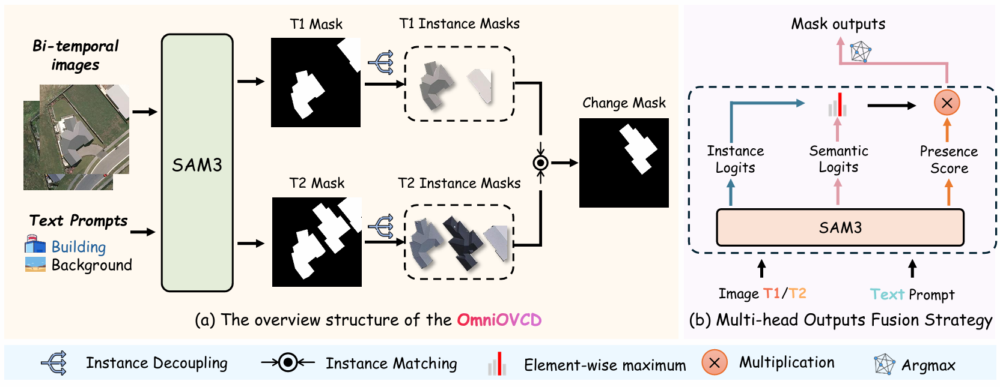
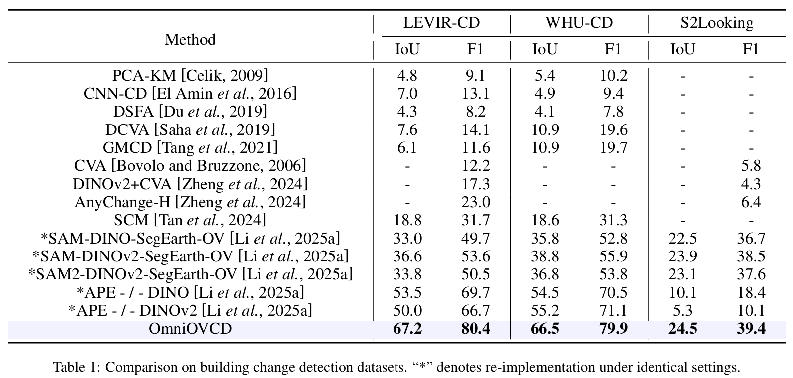
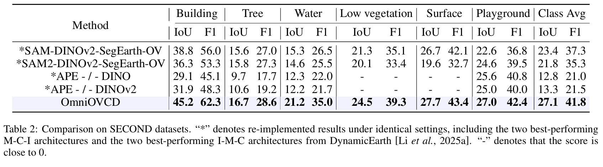

<h1 align="center"> OmniOVCD: Streamlining Open-Vocabulary Change Detection with SAM 3 </h1>

<h5 align="center"><em>Xu Zhang, Danyang Li, Yingjie Xia, Xiaohang Dong, Hualong Yu, Jianye Wang, and Qicheng Li* </em></h5>

<div>
    <h4 align="center">
        • <a href="https://github.com/Erxucomeon/OmniOVCD" target='_blank'>[Code]</a> • <a href="https://arxiv.org/abs/2601.13895" target='_blank'>[arXiv]</a> • 
    </h4>
</div>

# Introduction
Change Detection (CD) is a fundamental task in remote sensing. It monitors the evolution of land cover over time. Based on this, Open-Vocabulary Change Detection (OVCD) introduces a new requirement. It aims to reduce the reliance on predefined categories. Existing training-free OVCD methods mostly use CLIP to identify categories. These methods also need extra models like DINO to extract features. However, combining different models often causes problems in matching features and makes the system unstable. Recently, the Segment Anything Model 3 (SAM 3) is introduced. It integrates segmentation and identification capabilities within one promptable model, which offers new possibilities for the OVCD task. In this paper, we propose OmniOVCD, a standalone framework designed for OVCD. By leveraging the decoupled output heads of SAM 3, we propose a Synergistic Fusion to Instance Decoupling (SFID) strategy. SFID first fuses the semantic, instance, and presence outputs of SAM 3 to construct land-cover masks, and then decomposes them into individual instance masks for change comparison. This design preserves high accuracy in category recognition and maintains instance-level consistency across images. As a result, the model can generate accurate change masks. Experiments on four public benchmarks (LEVIR-CD, WHU-CD, S2Looking, and SECOND) demonstrate SOTA performance, achieving IoU scores of 67.2, 66.5, 24.5, and 27.1 (class-average), respectively, surpassing all previous methods.

---

<p align="center">
  
</p>

Figure 1: (a) shows the overview of OmniOVCD framework. The model takes bi-temporal images and corresponding text prompts to generate initial masks via SAM 3. These masks are then separated into instance masks for instance-level comparison, which produce the accurate change detection mask. (b) shows the multi-head outputs fusion strategy. This strategy fuses the semantic and instance head outputs from SAM3anduses the presence head outputs for filtering. This approach effectively improves the accuracy of single-image segmentation.

# Installation

1. Clone this repository and navigate to the base folder
```bash
git clone https://github.com/Erxucomeon/OmniOVCD.git
cd OmniOVCD
```

2. Install packages
```bash
conda create -n OmniOVCD python=3.11 -y
conda activate OmniOVCD
pip install -r requirements.txt
```
3. Download checkpoints of SAM 3

Download checkpoints from [HF](https://huggingface.co/facebook/sam3) or [ModelScope](https://modelscope.cn/models/facebook/sam3).

# Dataset 
## Download
Please download the data to the "./dataset" folder.
LEVIR-CD: You can download the data from [here](https://justchenhao.github.io/LEVIR/).
WHU-CD: You can download the data from [here](https://study.rsgis.whu.edu.cn/pages/download/building_dataset.html).
S2Looking: You can download the data from [here](https://github.com/S2Looking/Dataset).
SECOND: You can download the data from [here](https://captain-whu.github.io/SCD/).
## Preparing
Please run the following scripts to re-organize the LEVIR-CD dataset.
```
python ./dataset/split_images.py --input='./dataset/LEVIR-CD/test' --output='./dataset/LEVIR-CD/test_256'
```
```
python ./dataset/convert_labels.py --input='./dataset/LEVIR-CD/test_256/label' --output='./dataset/LEVIR-CD/test_256/label_cvt'
```
Please split the WHU-CD dataset into training, testing, and validation sets at a ratio of 8:1:1 into 256 \* 256 sizes, and run the following scripts to re-organize the WHU-CD dataset. 
```
python ./dataset/convert_labels.py --input='./dataset/WHU-CD/test_256/label' --output='./dataset/WHU-CD/test_256/label_cvt'
```
Please run the following scripts to re-organize the S2Looking dataset.
```
python ./dataset/convert_labels.py --input='./dataset/S2Looking/test/label' --output='./dataset/S2Looking/test/label_cvt'
```
Please run the following scripts to re-organize the SECOND dataset.
```
./dataset/SECOND/second_rgb_to_index_labels.py 
```
```
./dataset/SECOND/second_generate_label.py
```
```
./dataset/SECOND/second_convert_label.py
```

# Model evaluation
Take the LEVIR-CD dataset as an example.
```
bash ./levir_cd.sh
```
# Results
<p align="center">
  
</p><p align="center">
  s
</p>

# License 
This code repository is licensed under [Apache 2.0](./LICENSE).

# Acknowledgement 
We would like to thank the following projects for their contributions to this work:

- [SAM3](https://github.com/facebookresearch/sam3)
- [SegEarth-OV3](https://github.com/earth-insights/SegEarth-OV-3)
  
# Citation 

If you find our project useful for your research, please consider citing our paper and codebase with the following BibTeX:

```bibtex
@article{zhang2026omniovcd,
  title={OmniOVCD: Streamlining Open-Vocabulary Change Detection with SAM 3},
  author={Zhang, Xu and Li, Danyang and Xia, Yingjie and Dong, Xiaohang and Yu, Hualong and Wang, Jianye and Li, Qicheng},
  journal={arXiv preprint arXiv:2601.13895},
  year={2026}
}
```